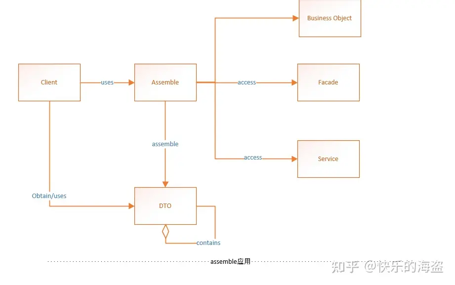
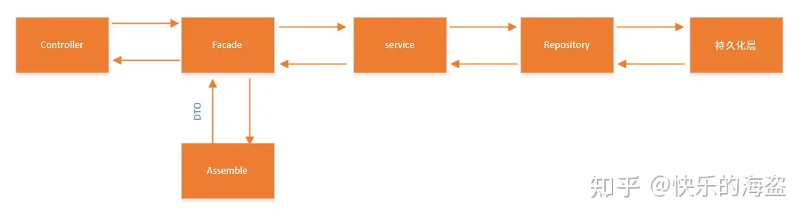

## 基于DDD的虚拟电厂后端服务

| 模块 | 描述  |   |
|----|-----|---|
|  masterdata  | 主数据 |   |
|  load  |     |   |   |
|  production  |     |   |
|  action  |     |   |

## http://localhost:8081/masterdata/api/

## 一、DDD模型分层

domain driver design这种模型分为四个部分：

* Infrastructure层
* Interface层
* Application层
* Domain层

## 二、Interface接口层：
该层包含与其他系统进行交互的接口与通信设施，多数应用中，该层可能提供包括web service，RMI 或Rest等在内的一种或多种通信接口，包含Facade，DTO和Assember三类组件

### 2.1、DTO（data transfer object）:
通常也被称作VO（Value Object），基于面向对象的技术的领域对象，都是细粒度的，将细粒度的领域对象传到远程端，需要进行多次网络通信，DTO在设计之初的考量是以粗粒度的数据结构以减少网络通信与简化接口调用。

### 2.2、Assembler：
DTO与领域对象之间的相互转换工作由Assemble承担

## 三、Application层：
该层主要组件是Service，该层也是非常薄的一层，所有的service只负责协调并委派业务逻辑给领域对象进行处理，其本身并未真正实现业务逻辑，绝大部分的业务逻辑都由领域对象承载和实现。

## 四、Domain层：
核心层，用于维护一个使用面向对象实现的领域模型，几乎所有的业务逻辑都在该层实现。

### 4.1、Entity：
实体所包含的不止一连串的属性，更重要的是与事件的联系，在实体的一切，都会受到外部因素的影响，不同时刻，实体会有不同状态，所以在开发过程中我们需要为实体加上一个“标识符”来区分对象的身份，它是实体生命周期里唯一的标志。

### 4.2、VO（Value Object）:
当所有的对象只有属性而没有其他逻辑关系，我们可以视它为值对象，值没有状态也不需要“标识符”，可以作为一个属性存在与实体内部。一般情况，值对象的属性是不可以改变的，当需要改属性时，可以把整个对象删除，然后重新加入一个新对象。

### 4.3、Repository：
用于把持久化对象转换成领域模型的一种方式，可用于获取更新持久化对象并管理它们的生命周期。它使应用层与持久化技术实现解耦，程序无需受限与何种数据库，但Repository是针对每一个根对象来划分边界的，person与order都有对应的Repository

## 五、Infrastructure层：
作为基础设施，Infrastructure为Interface, Domain, Application 三层提供支撑，所有与平台，框架相关的实现全在Infrastructure中提供，避免三层，特别是domain层参杂进这些实现，从而污染领域模型。Infrastructure中最常见的一类设施是对象持久化的具体实现。
